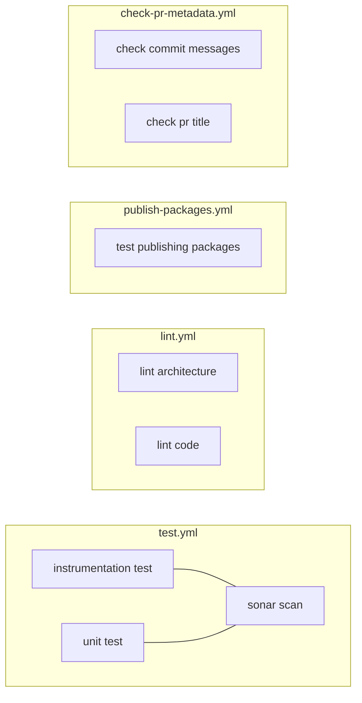
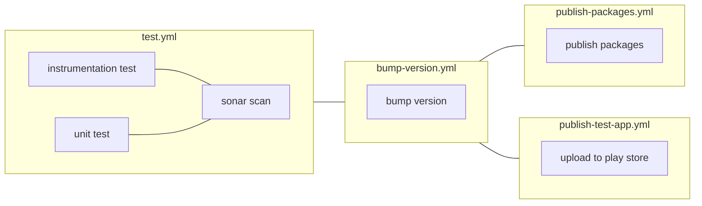

<!-- vale Vale.Spelling["Konsist", "NFC", "SDK", "SDKs", "SDK's"] = NO -->
<!-- vale Vale.Spelling["configurability", "modularisation", "subprojects"] = NO -->

# Technical guidance for contributors

The purpose of this document is to help contributors understand the technical features of this project, and their benefits, so that they may continue to contribute effectively.

Hopefully this also provides inspiration for others when designing Android SDKs. And it may help future SDK developers borrow and build upon the approach which aimed to improve the experience of developing and integrating Android SDKs through its self-contained dependency graph, modular architecture, configurability and testing strategy.

## Modularise the codebase

The Credential Issuer (CRI) Orchestrator SDK is split into feature modules and library modules. Feature modules contain code that is domain specific whereas library modules host reusable code that could one day be reused in a different project or domain. Library modules therefore, shouldn't contribute dependencies to the dependency injection (DI) graph.

Features are further split into implementation (`internal`) and API (`public-api` and `internal-api`) modules. This improves decoupling and encapsulation; mitigates cyclical dependencies; and enables better incremental build performance.

When contributing code, consider creating a new feature or library module if it doesn't fit well elsewhere.

The strategy for modularisation is based on advice from Google and further detail can be found in _[Module structure for Android SDKs]_.

We've developed a sample project as a reference implementation for the architecture which can be found at [govuk-one-login/mobile-android-sdk-architecture-sample]. The project's [ARCHITECTURE.md] describes the module structure.

## Validate the architecture

[Konsist] helps us verify that CRI Orchestrator SDK code conforms to project architecture. This helps developers continue to follow architectural patterns when making changes and reduces the burden of architectural code review.

It allows developers to write Kotlin unit tests for project architecture and code style, for example:
* To check that library modules don't depend on feature modules
* To check that compose previews aren't part of public API

See the [konsist-test module] for more examples.

When introducing a pattern to the codebase, that relies on developers knowing an unwritten rule, consider adding a Konsist test to validate it. The test is a great place to add a descriptive error message that helps developers understand the pattern when the test fails.

## Encapsulate the dependency graph

CRI Orchestrator SDK uses [Metro] for dependency injection. Further details about this design decision can be found in the [Metro decision document].

Choosing Metro enables us to keep the SDK's dependency graph self-contained and decoupled from the host app's dependency graph.

When implementing features, take care to encapsulate implementation details within a feature's `internal` module. Lean on Metro to contribute them to the SDK's dependency graph.

Metro also facilitates modular design through support for [graph aggregation] across modules.

The [Metro documentation] is a great resource for learning more about Metro, the problems it solves, how it compares to other solutions and how to use it.

## Share and reuse build logic

In a multi-module project, it's easy to end up in a situation where the same build logic is duplicated across many modules, which is a maintenance burden.

CRI Orchestrator SDK uses [govuk-one-login/mobile-android-pipelines] which contains a selection of Gradle plugins as a foundation for it's build logic. On top of this, it has it's own `build-logic` project for project local convention plugins (see [project build-logic]).

This supports the modular build by reducing duplication across `build.gradle.kts` files, enabling new modules to be created without too much maintenance overhead.

Further details can be found in _[Gradle - Sharing build logic between subprojects]_.

## Parallelise CI/CD jobs

Rather than one CI workflow per Github event (on pull request, on push main), CRI Orchestrator runs a number of different workflows to parallelise tasks for efficiency.

Additionally, workflows are split and chained in such a way that they can be rerun in isolation and reused in different contexts.

When adding a CI/CD step, consider whether it warrants it's own job / workflow that can run in parallel to existing jobs.

All the workflows can be found in [.github/workflows].

### Workflows that run on pull requests

Pull requests run several workflows in parallel, each with jobs that run in parallel.

### Workflows that run after merging a pull request

On the main branch, the same `test.yml` workflow is reused. After the test workflow passes, it then triggers a series of release workflows.

## Make features configurable for testing

One of the core features of CRI Orchestrator SDK is that it's configurable. Developers may configure the behaviour of the SDK by passing flags on initialisation and/or by embedding the project's developer menu in their app.

All features are designed such that behaviour can be configured at runtime, rather than being pre-configured at compile time.

This flexibility facilitates manual testing - for example:
* If a tester needs to test an 'unrecoverable error' resulting from a 500 network response, they can open the developer menu and configure a fake backend that returns this error.
* If a developer needs to simulate the experience of a user a device with NFC scanning capability using an emulator that doesn't support NFC scanning, they can configure this.

The public API restricts changing configuration at runtime after initialisation. However the (optional) developer menu doesn't have the same restriction, facilitating manual testing in non-production builds.

When adding a new feature, consider whether it needs any configuration options to enable testers to test it out.

## Prefer local tests over device tests

CRI Orchestrator SDK doesn't (yet) need to use instrumented device tests. For tests needing Android framework classes, it uses [Robolectric]. As a result, UI tests run a lot faster.

For more details about this decision, see the [Robolectric decision document].

## Generate screenshot tests from Compose previews

To cover the vast majority of UI code, CRI Orchestrator SDK uses [Paparazzi] for screenshot testing.

Developers don't need to write screenshot tests manually because they're automatically generated from Compose previews using [ComposablePreviewScanner].

---

[.github/workflows]: https://github.com/govuk-one-login/mobile-android-cri-orchestrator/tree/main/.github/workflows
[ARCHITECTURE.md]: https://github.com/govuk-one-login/mobile-android-sdk-architecture-sample/blob/main/ARCHITECTURE.md
[ComposablePreviewScanner]: https://github.com/sergio-sastre/ComposablePreviewScanner
[Gradle - Sharing build logic between subprojects]: https://docs.gradle.org/9.1.0/samples/sample_convention_plugins.html
[Konsist]: https://github.com/LemonAppDev/konsist
[Metro decision document]: https://github.com/govuk-one-login/mobile-android-cri-orchestrator/blob/main/docs/design-decisions/0003-dependency-injection-metro.md
[Metro]: https://github.com/ZacSweers/metro
[Metro documentation]: https://zacsweers.github.io/metro
[Module structure for Android SDKs]: https://docs.google.com/document/d/1O-UABYB9RaoTKO2IEPQpdJV6i0tEOiDJ4Xy0eppBq5s/edit?tab=t.0
[Paparazzi]: https://github.com/cashapp/paparazzi
[Robolectric decision document]: https://github.com/govuk-one-login/mobile-android-cri-orchestrator/blob/70468aaf4b61fb249c0e6523913b7e390b9b91a1/docs/design-decisions/0002-local-ui-tests.md
[Robolectric]: https://robolectric.org/
[govuk-one-login/mobile-android-pipelines]: https://github.com/govuk-one-login/mobile-android-pipelines
[govuk-one-login/mobile-android-sdk-architecture-sample]: https://github.com/govuk-one-login/mobile-android-sdk-architecture-sample
[graph aggregation]: https://zacsweers.github.io/metro/latest/aggregation.html
[konsist-test module]: https://github.com/govuk-one-login/mobile-android-cri-orchestrator/tree/70468aaf4b61fb249c0e6523913b7e390b9b91a1/konsist-test/src/test/kotlin/uk/gov/onelogin/criorchestrator/konsisttest
[project build-logic]: https://github.com/govuk-one-login/mobile-android-cri-orchestrator/tree/main/build-logic/plugins/src/main/kotlin/uk/gov/onelogin/criorchestrator